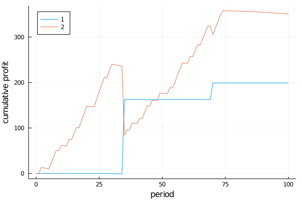
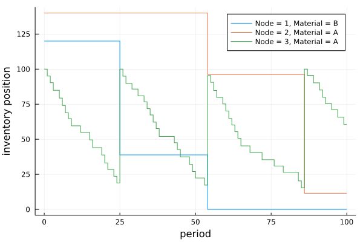

# InventoryManagement.jl:

*Discrete-time simulation environment for Inventory Management in Supply Networks.*


## Table of Contents

1. [Overview](#overview)
2. [Dependencies](#dependencies)
3. [Sequence of Events](#sequence-of-events)
4. [Model Assumptions](#model-assumptions)
5. [Model Limitations](#model-limitations)
6. [Inventory replenishment policies](#inventory-replenishment-policies)
7. [Model Inputs](#model-inputs)
8. [Model Output](#model-output)
9. [Example](#example)
10. [Contact](#contact)

## Overview

*InventoryManagement.jl* allows modeling a [make-to-order](en.wikipedia.org/wiki/Build_to_order) multi-period multi-product supply network. A supply network can be constructed using the following node types:
- `Producers`: Nodes where inventory transformation takes place (e.g., intermediates or final products are produced). Reactive systems with co-products can be modelled using a [Bill of Materials](https://en.m.wikipedia.org/wiki/Bill_of_materials) (see [Model Inputs section](#graph-specific)).
- `Distributors`: Intermediate nodes where inventory is stored and distributed (e.g., distribution centers).
- `Markets`: Nodes where end-customers place final product orders. These are the last (sink) nodes in the network.

The simplest network that can be modeled is one with a single market with one producer or distributor. However, more complex systems can be modelled as well.

When defining a supply network, a `SupplyChainEnv` object is created based on system inputs and network structure. This object can then be used to execute a simulation of the inventory dynamics. During a simulation, stochastic demand at each of the markets can occur for each of the products in each period. When product demand occurs at the market, sales are made based on available inventory. Any unfulfilled demand is either backlogged or considered a lost sale depending on the system definition. If no action is taken duirng the simulation, the inventory levels will eventually be depleted. To avoid this from happening, a decision-maker can interact with the system in each period by making inventory replenishment decisions (refered to as `actions`). Lead times for in-transit inventory as well as production lead times are accounted for in the simulation. Transportation lead times can be modelled stochastically to account for lead time uncertainty. From a service time perspective, demand at market nodes has zero service time, whereas non-market nodes have service time equal to the production lead time + transportation lead time.

The `SupplyChainEnv` can also potentially be used in conjunction with [ReinforcementLearning.jl](https://github.com/JuliaReinforcementLearning/ReinforcementLearning.jl) to train a Reinforcement Learning `agent`.

This package generalizes and extends and the inventory management environment available in [OR-Gym](https://github.com/hubbs5/or-gym).

## Dependencies

*InventoryManagement.jl* mainly relies on the following packages:
- [MetaGraphs.jl](https://github.com/JuliaGraphs/MetaGraphs.jl): Define supply network structure and specify node- and edge-specific parameters.
- [DataFrames.jl](https://github.com/JuliaData/DataFrames.jl): Tabulate results.
- [Distributions.jl](https://github.com/JuliaStats/Distributions.jl): Define probability distributions for the lead times in between nodes and the market demands at the end distributors.

## Sequence of Events

The following sequence of events occurs in each period of the simulation:
1. Start period.
2. Place inventory replenishment orders at each node. These are limited to the available production capacity (supplier is a producer) or available inventory. If `reallocate = true`, then any amount that cannot be satisfied is reallocated to the next priority supplier.
   - Distributors ship inventory.
   - Producers attempt to satisfy order with any on-hand inventory and then manufacture products for any amount remaining (a production lead time begins). Production costs are incurred at the start of production.
   - Producers send orders that have completed (after the production lead time).
4. Receive inventory that has arrived at each node (after the lead time has transpired).
5. Pay suppliers for inventory received.
6. Pay shipper for inventory shipped.
7. Market demand occurs after tossing a weighted coin with the probability of demand occurring defined by the `demand_frequency`.
8. Demand (including any backlog if `backlog = true`) is fulfilled up to available inventory at the markets.
9. Unfulfilled demand is penalized and backlogged (if `backlog = true`).
10. Each node pays a holding cost and a transportation cost for on-hand inventory and in-transit inventory at each period.

## Model Assumptions

The following assumptions hold in the current implementation, but can be modified in future releases.

- `Producers` produce material on demand (`make-to-order`).
- Replenishment orders can only be satisfied with current on-hand inventory or available production capacity.
- Backlogging is only allowed at the `Markets`, it is not allowed for inventory replenishment decisions.
- Transportation costs are paid to a third party (not a node in the network).

## Model Limitations

The following features are not currently supported:

- Alternate bills of materials (see [Bill of Materials](#graph-specific)) for the same product are not supported. This is particularly relevant for chemical systems. However, the following workarounds can be done:
  - If the alternate reaction pathway has a byproduct then the main product can be included as a co-product of the bill of materials for the other one. For example: A system with 5 materials (`:A-:E`) can have two ways to produce `:A` `:B + :C -> :A` and `:D -> :A + :E`. The column for product `:A` can have the bill of material: `[0 -1 -1 0 0]`. The column for product `:E` can have the bill of materials: `[1 0 0 -1 0]`. However, `:A` will only be produced by the second pathway if a request for `:D` is made. 
  - Make a copy of the material to specify an alternate pathway. This will require specifying parameters for the copied material throughout the network. 

## Inventory replenishment policies

At each iteration in the simulation, an `action` can be provided to the system, which consists of the replenishment orders placed on every link in the supply network. This `action` must be of type `Vector{Real}` and must be `nonnegative` of the form: `[Edge1_Product1, Edge1_Product2, ..., Edge1_ProductP, Edge2_Product1, ..., Edge2_ProductP, ..., EdgeE_Product1, ..., EdgeE_ProductP]`, where the ordering in the edges is given by `edges(env.network)` and the ordering in the products by `env.products`.

An `action` vector can be visualized as a `DataFrame` using `show_action(action, env::SupplyChainEnv)`.

The function `reorder_policy` can be used to implement an inventory reorder policy. The two most common policies used in industry are the `(s,S)` and `(r,Q)` [policies](https://smartcorp.com/inventory-control/inventory-control-policies-software/).

The `reorder_policy` takes the following inputs and returns an `action` vector.
- `env::SupplyChainEnv`: inventory management environment
- `param1::Dict`: the `s` or `r` parameter in each node for each product in the system. The `keys` are of the form `(node, product)`.
- `param2::Dict`: the `S` or `Q` parameter in each node for each product in the system. The `keys` are of the form `(node, product)`.
- `level::Symbol`: `:position` if the policy is based on the node's inventory position, or `:on_hand` if the policy is based on the node's on-hand inventory level.
- `kind::Symbol`: `:rQ` for an `(r,Q)` policy, or `:sS` for an `(s,S)` policy
- `supplier_selection::Symbol`: evenly distribute reorder quantities among all suppliers if `:random`; otherwise (if `:priority`), assign reorder quantities based on supplier priority (e.g., if supplier 1 does not have enough capacity or inventory, then request as much as possible and then request any remaining amount from the next supplier, and so forth).

## Model Inputs

### Node-specific

`Producers` will have the following fields in their node metadata:
- `:initial_inventory::Dict`: initial inventory for each product (`keys`)
- `:holding_cost::Dict`: unit holding cost for each product (`keys`)
- `:supplier_priority::Dict`: (*only when the node has at least 1 supplier*) `Vector` of supplier priorities (from high to low) for each product (`keys`). When a request cannot be fulfilled due to insufficient productio capacity or on-hand inventory, the system will try to reallocate it to the supplier that is next in line on the priority list (if `env.reallocate == true`).
- `:production_cost::Dict`: unit production cost for each product (`keys`)
- `:production_capacity::Dict`: maximum production capacity for each product (`keys`).
- `:production_time::Dict`: production lead time for each product (`keys`).

`Distributors` will have the following fields in their node metadata:
- `:initial_inventory::Dict`: initial inventory for each product (`keys`)
- `:holding_cost::Dict`: unit holding cost for each product (`keys`)
- `:supplier_priority::Dict`: `Vector` of supplier priorities (from high to low) for each product (`keys`). When a request cannot be fulfilled due to insufficient productio capacity or on-hand inventory, the system will try to reallocate it to the supplier that is next in line on the priority list (if `env.reallocate == true`).

`Markets` will have the following fields in their node metadata:
- `:initial_inventory::Dict`: initial inventory for each product (`keys`)
- `:holding_cost::Dict`: unit holding cost for each product (`keys`)
- `:supplier_priority::Dict`: `Vector` of supplier priorities (from high to low) for each product (`keys`). When a request cannot be fulfilled due to insufficient productio capacity or on-hand inventory, the system will try to reallocate it to the supplier that is next in line on the priority list (if `env.reallocate == true`).
- `:demand_distribution::Dict`: probability distributions for the market demands for each product (`keys`)
- `:demand_frequency::Dict`: probability that demand will occur (value between `0.0` and `1.0`) for each product (`keys`)
- `:sales_price::Dict`: market sales price for each product (`keys`)
- `:demand_penalty::Dict`: unit penalty for unsatisfied market demand for each product (`keys`)

### Edge-specific

All edges have the following fields in their metadata:
- `:sales_price::Dict`: unit sales price for inventory sent on that edge (from supplier to receiver) for each product (`keys`)
- `:transportation_cost::Dict`: unit transportation cost per period for inventory in-transit for each product (`keys`)
- `:lead_time::Distribution{Univariate, Discrete}`: the lead time on each edge

### Graph-specific

The graph metadata should have the following fields in its metadata:
- `:products::Vector` with a list of all materials in the system.
- `:bill_of_materials::Matrix`: bill of materials indicating the production recipies for the materials in the system. The row numbers correspond to the input materials and the column numbers to the output materials. The numbering matches that of the `products` vector. The magnitude of each element is proportional to the production of one unit of output material. Each element can have one of three types of values:
  - `zero`: input not involved in production of output.
  - `negative number`: input is consumed in the production of output.
  - `positive number`: input is a co-product of the output.

## Model Output

A `SupplyChainEnv` has the following fields:
- `network::MetaDiGraph`: Supply Chain Network (metagraph)
- `markets::Array`: list of market nodes
- `producers::Array`: list of producer nodes
- `distributors::Array`: list of distribution nodes (excludes end distributors where markets exist)
- `products::Array`: list of all product (material) names (strings)
- `inv_on_hand::DataFrame`: timeseries On Hand Inventory @ each node at the end of each period
- `inv_pipeline::DataFramet`: timeseries Pipeline Inventory on each edge at the end of each period
- `inv_position::DataFrame`: timeseries Inventory Position for each node at the end of each period
- `replenishments::DataFrame`: timeseries Replenishment orders placed on each edge at the end of each period
- `shipments::DataFrame`: current shipments and time to arrival for each node
- `production::DataFrame`: current material production committed to an edge and lead time to ship
- `demand::DataFrame`: timeseries with realization of demand, sold units, unfulfilled demand, and backlog at each market
- `profit::DataFrame`: timeseries with profit at each node
- `reward::Float64`: reward in the system (used for RL)
- `period::Int`: period in the simulation
- `num_periods::Int`: number of periods in the simulation
- `discount::Float64`: time discount factor (interest rate)
- `backlog::Bool`: backlogging allowed if `true`; otherwise, unfulfilled demand is lost sales
- `reallocate::Bool`: the system try to reallocate requests if they cannot be satisfied if `true`; otherwise, no reallocation is attempted.
- `seed::Int`: random seed

## Example

The example below is for a 100 period simulation of a supply network with one plant (node 1) that supplies and end distributor (node 2). A `s,S` reorder policy is used.

```julia
using LightGraphs, MetaGraphs, DataFrames, Distributions
using InventoryManagement, StatsPlots

#define network connectivity
net = MetaDiGraph(path_digraph(2)) # 1 -> 2
products = [:A, :B]
bom = [0 0; # B -> A
      -1 0]
set_prop!(net, :products, products)
set_prop!(net, :bill_of_materials, bom)

#specify parameters, holding costs and capacity, market demands and penalty for unfilfilled demand
set_props!(net, 1, Dict(:initial_inventory => Dict(:A => 0, :B => 100),
                        :holding_cost => Dict(:A => 0, :B => 0),
                        :production_cost => Dict(:A => 0.01, :B => 0),
                        :production_time => Dict(:A => 0, :B => 0),
                        :production_capacity => Dict(:A => Inf, :B => 0)))

set_props!(net, 2, Dict(:initial_inventory => Dict(:A => 100, :B => 0),
                        :holding_cost => Dict(:A => 0.01, :B => 0),
                        :demand_distribution => Dict(:A => Normal(5,0.5),
                                                     :B => zeros(2)),
                        :demand_frequency => Dict(:A => 0.5, :B => 0),
                        :sales_price => Dict(:A => 3, :B => 0),
                        :demand_penalty => Dict(:A => 0.01, :B => 0),
                        :supplier_priority => Dict(:A => [1], :B => [1])))

#specify sales prices, transportation costs, lead time
set_props!(net, 1, 2, Dict(:sales_price => Dict(:A => 2, :B => 0),
                          :transportation_cost => Dict(:A => 0.01, :B => 0),
                          :lead_time => Poisson(5)))

#create environment
num_periods = 100
env = SupplyChainEnv(net, num_periods)

#define reorder policy parameters
policy = :sS #(s, S) policy
on = :position #monitor inventory position
s = Dict((2,:A) => 20, (2,:B) => 0) #lower bound on inventory
S = Dict((2,:A) => 100, (2,:B) => 0) #base stock level

#run simulation with reorder policy
for t in 1:env.num_periods
    action = reorder_policy(env, s, S, on, policy, :priority)
    (env)(action)
end

#make plots
#profit
node_profit = groupby(env.profit, :node)
profit = transform(node_profit, :value => cumsum)
fig1 = @df profit plot(:period, :value_cumsum, group=:node, legend = :topleft,
                    xlabel="period", ylabel="cumulative profit")

#inventory position
fig2 = @df env.inv_position plot(:period, :level, group=(:node, :product), linetype=:steppost,
                    xlabel="period", ylabel="inventory position")
```



## Contact

**Author**: Hector D. Perez\
**Position**: Ph. D. Candidate @ Carnegie Mellon University\
**Email**: hdperez@cmu.edu\
**Year**: 2021
