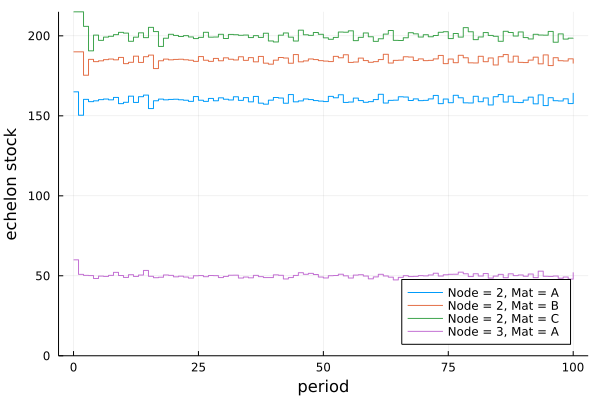

# InventoryManagement.jl:

*Discrete-time simulation environment for Inventory Management in Supply Chain Networks.*

[](https://zenodo.org/badge/latestdoi/357413023)


## Table of Contents

1. [Overview](#overview)
2. [Dependencies](#dependencies)
3. [Installation](#installation)
4. [Sequence of Events](#sequence-of-events)
5. [Inventory replenishment policies](#inventory-replenishment-policies)
6. [Model Assumptions](#model-assumptions)
7. [Model Limitations](#model-limitations)
8. [Creating a Supply Chain Network](#creating-a-supply-chain-network)
    - [General Network Parameters](#general-network-parameters)
    - [Node-specific Parameters](#node-specific-parameters)
    - [Arc-specific Parameters](#arc-specific-parameters)
9. [Creating a Supply Chain Environment](#creating-a-supply-chain-environment)
10. [Simulation Outputs](#simulation-outputs)
11. [Examples](#examples)
    - [Example #1: Deterministic 2-echelon system with material transformation and continuous review (s,S) policy](#example-1)
    - [Example #2: Stochastic 2-echelon distribution system with periodic (r,Q) policy](#example-2)
    - [Example #3: Stochastic 3-echelon system with material transformation and continuous review (s,S) policy](#example-3)
12. [Contact](#contact)

## Overview

*InventoryManagement.jl* allows modeling a multi-period multi-product supply chain network under stochastic stationary demand and stochastic lead times. A supply network can be constructed using the following types of nodes:
- `Producers`: Nodes where inventory transformation takes place (e.g., raw materials are converted to intermediates or finished goods). Material transformation, including reactive systems with co-products, are modeled using [Bills of Materials](https://en.wikipedia.org/wiki/Bill_of_materials) (see [Model Inputs section](#node-specific-parameters)).
- `Distributors`: Nodes where inventory is stored and distributed (e.g., distribution centers).
- `Markets`: Nodes where end-customers place final product orders (e.g., retailer). 

These types of nodes can be used to model the following components of a supply network:
- `Manufacturing Plants`: Plants are modeled using at least two nodes joined by a directed arc:
  - Raw material storage node: Upstream `producer` node that stores raw materials and the plant's `bill of materials`.
  - Product storage node: Downstream `distributor` node that stores the materials produced at the plant.
  - Arc: the time elapsed between the consumption of raw materials and the production of goods (production time) is modeled with the arc lead time.
- `Distribution Centers`: DCs are modeled using `distributor` nodes.

Note: Any node can be marked as a `market` node to indicate that there is external demand for one or more materials stored at that node. This allows external demand at distribution centers or at manufacturing plants (either for raw materials or products).

The simplest network that can be modeled is one with a single retailer (`distributor`) with external demand (`market`) that is supplied by a warehouse (`distributor`). However, more complex systems can be modelled as well.

When defining a supply network, a `SupplyChainEnv` object is created based on system inputs and network structure. This object can then be used to simulate the inventory dynamics under a stochastic environment and a specified inventory management policy. Stochasticity is modeled in the external demand quantities at the `market` nodes and in the lead times between connected nodes in the network. However, deterministic values can also be used for external demand or lead times if desired. In each period of the simulation, a decision-maker can specify inventory replenishnment orders throughout the network (refered to as `actions`), which consist of the inventory quantities requested by each node to each immediate supplier for each material in the system. If no action is taken during the simulation, the inventory levels will eventually be depleted by the external demand. Depending on the system configuration, unfulfilled external or internal demand can be either backlogged or considered a lost sale.

The `SupplyChainEnv` can also potentially be used in conjunction with [ReinforcementLearning.jl](https://github.com/JuliaReinforcementLearning/ReinforcementLearning.jl) to train a Reinforcement Learning `agent` that places replenishment orders (`actions`) throughout the network.

This package generalizes and extends and the inventory management environment available in [OR-Gym](https://github.com/hubbs5/or-gym).

## Dependencies

*InventoryManagement.jl* relies primarily on the following packages:
- [DataFrames.jl](https://github.com/JuliaData/DataFrames.jl): Tabulate results.
- [Distributions.jl](https://github.com/JuliaStats/Distributions.jl): Define probability distributions for the lead times on the network arcs and the demand quantities at the market nodes.
- [Graphs.jl](https://github.com/JuliaGraphs/Graphs.jl): Define supply network topology
- [MetaGraphs.jl](https://github.com/JuliaGraphs/MetaGraphs.jl): Specify system parameters for each node or arc, or for the system as a whole.

## Installation

The package can be installed with the Julia package manager. From the Julia REPL, type `]` to enter the `Pkg` REPL mode and run:

```julia
pkg> add InventoryManagement
```

For the master branch, run:
```julia
pkg> add https://github.com/hdavid16/InventoryManagement.jl
```

## Sequence of Events

The sequence of events in each period of the simulation is patterned after that of the [News Vendor Problem](https://optimization.cbe.cornell.edu/index.php?title=Newsvendor_problem):
1. Start period.
2. Place inventory replenishment orders at each node by traversing the supply network downstream (using [topological sorting](https://en.wikipedia.org/wiki/Topological_sorting)).
  - If `backlog = true`, the previous period's backlog is added to the replenishment order. 
  - The supplier to the node placing the order will attempt to fill the replenishment order via its on-hand inventory if possible. If the supplier is a `producer` node and its on-hand inventory is insufficient, the supplier will then attempt to fulfill the order via material production (if there is sufficient `production capacity` and `raw material inventory`). 
  - If `reallocate = true`, then any amount that cannot be satisfied is reallocated to the next supplier in the `supplier priority` list (the lowest priority supplier will reallocate back to the highest priority supplier). 
  - Accepted replenishment orders are immediately shipped with a lead time sampled from the specified distribution. For `distributor` nodes, the lead time is the in-transit (transportation) time between `distributor` nodes. For `producer` nodes, the lead time is the plant production time. 
  - If the lead time is 0, the stock will be immediately available to the requesting node so that it can be used to fulfill downstream orders as they arrive (possible due to the topological sorting).
4. Receive inventory that has arrived at each node (after the lead time has transpired).
5. Market demand for each material occurs after tossing a weighted coin with the probability of demand occurring defined by the inverse of the `demand_period` (average number of periods between positive external demands).
  - For example, if `demand_period = 2`, there is a `1/2 = 50%` chance of having positive demand, or once every 2 days on average.
8. Demand (including any backlog if `backlog = true`) is fulfilled up to available inventory at the `market` nodes.
9. Unfulfilled demand is backlogged (if `backlog = true`).
10. Accounts for each node are generated:
  - Accounts payable: invoice for fulfilled replenishment orders (payable to suppliers), invoice for delivered replenishment orders (payable to third-party shipper), pipeline inventory holding cost for in-transit inventory (cost to requestor), on-hand inventory holding cost, penalties for unfulfilled demand (cost to supplier).
  - Accounts receivable: sales for internal and external demand.

## Inventory replenishment policies

At each iteration in the simulation, an `action` can be provided to the system, which consists of the replenishment orders placed on every link in the supply network. This `action` must be of type `Vector{Real}` and must be `nonnegative` of the form: `[Arc_1_Material_1, Arc_1_Material_2, ..., Arc_1Material_M, Arc_2_Material_1, ..., Arc_2_Material_M, ..., Arc_A_Material_1, ..., Arc_A_Material_M]`, where the ordering in the arcs is given by `edges(SupplyChainEnv.network)` and the ordering in the materials by `SupplyChainEnv.materials`.

An `action` vector can be visualized as a `NamedArray` using `show_action(SupplyChainEnv, action)`:

```julia
material ╲ arc │ :Arc_1  :Arc_2 ... :Arc_A
───────────────┼──────────────────────────
:Material_1    │  
:Material_2    │  
...            │
:Material_M    │  
```

The function `reorder_policy` can be used to implement an inventory reorder policy at each node based its inventory position or echelon stock. Reorder quantities are placed to the node's priority supplier. The reorder policy is applied for each `material` at each `node` in reverse [topological order](https://en.wikipedia.org/wiki/Topological_sorting). This allows upstream nodes to determine their reorder quantities with information about the reorder quantities placed by their successors (relevant for `producer` nodes to ensure that raw material replenishments are synced with production orders). The two most common policies used in industry are the `(s,S)` and `(r,Q)` [policies](https://smartcorp.com/inventory-control/inventory-control-policies-software/).

The `reorder_policy` takes the following inputs and returns an `action` vector.
- `env::SupplyChainEnv`: inventory management environment
- `reorder_point::Dict`: the `s` or `r` parameter in each node for each material in the system. The `keys` are of the form `(node, material)`.
- `policy_param::Dict`: the `S` or `Q` parameter in each node for each material in the system. The `keys` are of the form `(node, material)`.
- `policy_type::Union{Symbol, Dict}`: `:rQ` for an `(r,Q)` policy, or `:sS` for an `(s,S)` policy. If passing a `Dict`, the policy type should be specified for each node (`keys`).
- `review_period::Union{Int, AbstractRange, Vector, Dict}`: number of periods between each inventory review (Default = `1` for continuous review.). If a `AbstractRange` or `Vector` is used, the `review_period` indicates which periods the review is performed on. If a `Dict` is used, the review period should be specified for each `(node, material)` `Tuple` (`keys`). The values of this `Dict` can be either `Int`, `AbstractRange`, or `Vector`. Any missing `(node, material)` key will be assigned a default value of 1.
- `min_order_qty::Union{Real, Dict}`: minimum order quantity (MOQ) at each supply node. If a `Dict` is passed, the MOQ should be specified for each `(node, material)` `Tuple` (keys). The values should be `Real`. Any missing key will be assigned a default value of 0. 
- `adjust_expected_consumption::Bool`: indicator if the reorder point should be increased (temporarilly) at a `producer` node by the expected raw material consumption for an expected incoming production order.

## Model Assumptions

The following assumptions hold in the current implementation, but can be modified in future releases.

- Production lead times are independent of the amount being produced.
- Transportation costs are paid to a third party (not a node in the network).
- Replenishment orders are placed in [topological order]((https://en.wikipedia.org/wiki/Topological_sorting)). This means that upstream nodes place orders first. This allows the following scenario: if the lead time is 0, the ordered inventory will immediately be available so that the node can use it to fulfill downstream orders.

## Model Limitations

The following features are not currently supported:

- Alternate bills of materials (see [Model Inputs](#general-network-parameters)) for the same material are not currently supported. This is particularly relevant for chemical systems (e.g., there are two reactions that can be used to make the same product).
- Capacity limitations on shared feedstock inventory among `producer` nodes (e.g., shared inventory tanks) are not enforced in a straightforward way since `producer` nodes have dedicated raw material storage. Shared feedstock inventory can be modeled by having an upstream storage node with zero lead time to each of the `producer` nodes. Each of the `producer` nodes should use an `(s,S)` replenishment policy with `s = 0, S = 0`. When a production order is of size `x` is going to be placed in a period, the policy will assume the feedstock position at the `producer` node is going to derop to `-x` and will order `x` to bring the position up to `0`. Since the lead time is `0` and orders are placed with topological sorting (see [Sequence of Events]($sequence-of-events)), the inventory will be immediately sent to the `producer` node and be available for when the production order comes in. However, if there is not enough production capacity to process `x`, the excess will be left in the dedicated storage for that `producer` node, making it possible to violate the shared inventory capacity constraint.
- If a `producer` can produce more than 1 material, it is possible for it to produce all materials it is capable of producing simultaneously (if there are enough raw materials). This occurs because the model does not account for resource constraints (e.g., single reactor can only do reaction 1 or reaction 2, but not both simultaneously). However, these can be enforced manually with the reorder actions. Potential fixes (requires changing the source code):
  - Drop inventory capacities to 0 when the production equipment is occupied. Requires modeling each production unit as its own node.
  - Develop a production model (perhaps based on the Resource-Task Network paradigm)

## Creating a Supply Chain Network

The supply network topology must be mapped on a network graph using [Graphs.jl](https://github.com/JuliaGraphs/Graphs.jl). The system parameters are stored in the network's metadata using [MetaGraphs.jl](https://github.com/JuliaGraphs/MetaGraphs.jl). The network can be generated by using the `MetaDiGraph` function and passing one of the following:
- Number of nodes in the network, which can the be connected via the `connect_nodes!` function:
```julia
net = MetaDiGraph(3)
connect_nodes!(net,
  1 => 2,
  2 => 3
)
```
- An adjacency matrix for the network:
```julia
net = MetaDiGraph(
  [0 1 0;
   0 0 1;
   0 0 0]
)
```
- An existing `DiGraph`, such as a serial directed graph (`path_digraph`):
```julia
net = MetaDiGraph(path_digraph(3))
```

General network, node-specific, and arc-specific metadata can be added using the `set_prop!` and `set_props!` functions. The following subsections describe the property keys accepted for the supply chain network metadata.

### General Network Parameters

The graph metadata should have the following fields in its metadata:
- `:materials::Vector` with a list of all materials in the system.

### Node-specific Parameters

`Producers` will have the following fields in their node metadata:
- `:initial_inventory::Dict`: initial inventory for each material (`keys`). Default = `0`.
- `:inventory_capacity::Dict`: maximum inventory for each material (`keys`). Default = `Inf`.
- `:holding_cost::Dict`: unit holding cost for each material (`keys`). Default = `0`.
- `:supplier_priority::Dict`: (*only when the node has at least 1 supplier*) `Vector` of suppliers (from high to low priority) for each material (`keys`). When a request cannot be fulfilled due to insufficient production capacity or on-hand inventory, the system will try to reallocate it to the supplier that is next in line on the priority list (if `reallocate = true`). Default = `inneighbors(SupplyChainEnv.network, node)`.
- `:production_capacity::Dict`: maximum production capacity for each material (`keys`). Default = `Inf`.
- `:bill_of_materials::Union{Dict,NamedArray}`: `keys` are material `Tuples`, where the first element is the input material and the second element is the product/output material; the `values` indicate the amount of input material consumed to produce 1 unit of output material. Alternatively, a `NamedArray` can be passed where the input materials are the rows and the output materials are the columns. The following convention is used for the bill of material (BOM) values:
  - `zero`: input not involved in production of output.
  - `negative number`: input is consumed in the production of output.
  - `positive number`: input is a co-product of the output.

`Distributors` will have the following fields in their node metadata:
- `:initial_inventory::Dict`: initial inventory for each material (`keys`). Default = `0`.
- `:inventory_capacity::Dict`: maximum inventory for each material (`keys`). Default = `Inf`.
- `:holding_cost::Dict`: unit holding cost for each material (`keys`). Default = `0`.
- `:supplier_priority::Dict`: `Vector` of supplier priorities (from high to low) for each material (`keys`). When a request cannot be fulfilled due to insufficient productio capacity or on-hand inventory, the system will try to reallocate it to the supplier that is next in line on the priority list (if `reallocate = true`). Default = `inneighbors(SupplyChainEnv.network, node)`.

`Markets` will have the following fields in their node metadata:
- `:initial_inventory::Dict`: initial inventory for each material (`keys`). Default = `0`.
- `:inventory_capacity::Dict`: maximum inventory for each material (`keys`). Default = `Inf`.
- `:holding_cost::Dict`: unit holding cost for each material (`keys`). Default = `0`.
- `:supplier_priority::Dict`: `Vector` of supplier priorities (from high to low) for each material (`keys`). When a request cannot be fulfilled due to insufficient productio capacity or on-hand inventory, the system will try to reallocate it to the supplier that is next in line on the priority list (if `reallocate = true`). Default = `inneighbors(SupplyChainEnv.network, node)`.
- `:demand_distribution::Dict`: probability distributions from [Distributions.jl](https://github.com/JuliaStats/Distributions.jl) for the market demands for each material (`keys`). For deterministic demand, instead of using a probability distribution, use `D where D <: Number`. Default = `0`.
- `:demand_period::Dict`: mean number of periods between demand arrivals for each material (`keys`). Default = `1`.
- `:demand_sequence::Dict`: a user specified `Vector` of market demand for each material (`keys`). When a nonzero `Vector` is provided, the `demand_distribution` and `demand_period` parameters are ignored. Default = `zeros(SupplyChainEnv.num_periods)`.
- `:sales_price::Dict`: market sales price for each material (`keys`). Default = `0`.
- `:unfulfilled_penalty::Dict`: unit penalty for unsatisfied market demand for each material (`keys`). Default = `0`.
- `:service_time::Dict`: service time allowed to fulfill market demand for each material (`keys`). This parameter is only relevant if `guaranteed_service = true`. Default = `0`.

### Arc-specific Parameters

All arcs have the following fields in their metadata:
- `:sales_price::Dict`: unit sales price for inventory sent on that edge (from supplier to receiver) for each material (`keys`). Default = `0`.
- `:transportation_cost::Dict`: unit transportation cost for shipped inventory for each material (`keys`). Default = `0`.
- `:pipeline_holding_cost::Dict`: unit holding cost per period for inventory in-transit for each material (`keys`). Default = `0`.
- `:unfulfilled_penalty::Dict`: unit penalty for unsatisfied internal demand for each material (`keys`). Default = `0`.
- `:lead_time::Distribution{Univariate, Discrete}`: probability distributions from [Distributions.jl](https://github.com/JuliaStats/Distributions.jl) for the lead times for each material (`keys`) on that edge. Lead times are transportation times when the edge has two `distributor` nodes and production times when the edge joins the `producer` and `distributor` nodes in a plant. For deterministic lead times, instead of using a probability distribution, use `L where L  <: Number`. Default = `0`.
- `:service_time::Dict`: service time allowed to fulfill internal demand for each material (`keys`). This parameter is only relevant if `guaranteed_service = true`. Default = `0`.

## Creating a Supply Chain Environment

The `SupplyChainEnv` function can be used to create a `SupplyChainEnv` Constructor.
This function takes the following inputs:
- Positional Arguments:
  - `Network::MetaDiGraph`: supply chain network with embedded metadata
  - `num_periods::Int`: number of periods to simulate
- Keyword Arguments (system options):
  - `backlog::Bool = true`: backlogging allowed if `true`; otherwise, unfulfilled demand is lost sales.
  - `reallocate::Bool = false`: the system try to reallocate requests if they cannot be satisfied if `true`; otherwise, no reallocation is attempted.
  - `guaranteed_service::Bool = false`: the simulation will operate under the assumptions in the Guaranteed Service Model ([GSM](https://www.sciencedirect.com/science/article/pii/S1474667016333535)). If `true`, `backlog = true` will be forced. Orders that are open and within the service time window will be backlogged. Once the service time expires, the orders become lost sales. In order to replicate the GSM assumption that extraordinary measures will be used to fulfill any expired orders, a dummy node with infinite supply can be attached to each node and set as the lowest priority supplier to that node.
  - `capacitated_inventory::Bool = true`: the simulation will enforce inventory capacity constraints by discarding excess inventory at the end of each period if `true`; otherwise, the system will allow the inventory to exceed the specified capacity.
  - `evaluate_profit::Bool = true`: the simulation will calculate the proft at each node if `true` and save the results in `SupplyChainEnv.profit`.
- Aditional Keyword Arguments:
  - `discount::Float64 = 0.`: discount factor (i.e., interest rate) to account for the time-value of money.
  - `seed::Int = 0`: random seed for simulation.

## Simulation Outputs

The `SupplyChainEnv` Constructor has the following fields to store the simulation results in `DataFrames`:
- `inventory_on_hand`: on-hand inventory for each `node`, `material`, and `period`. Discarded inventory is marked when `capacitated_inventory = true`
- `inventory_level`: inventory level for each `node`, `material`, and `period`
- `inventory_pipeline`: in-transit inventory for each `arc`, `material`, and `period`
- `inventory_position`: inventory position for each `node`, `material`, and `period`
- `echelon_stock`: inventory position for each `echelon`, `material`, and `period`
- `demand`: internal and external demands for each `material` on each `arc` (for internal demand) and each `node` (for external demand), at each `period`. The total demand quantities, fulfilled demand quantities, lead times and unfulfilled demand quantities are tabulated. If `reallocate = true` and the unfulfilled demand is reallocated, the `arc` that the demand is reallocated to is also indicated.
- `orders`: internal and external orders for each `material` on each `arc` (for internal demand) and each `node` (for external demand). The ID, creation date, and quantity are stored for each order. The `fulfilled` column has a vector of `Tuples` that indicate the fulfillment time, supplier, and amount fulfilled. More than one `Tuple` will be shown if the order has been split.
- `open_orders`: open (not yet fulfilled) internal and external orders for each `material` on each `arc` (for internal demand) and each `node` (for external demand). The ID, creation date, and quantity are stored for each open order. The `due` column indicates the time left until the order is due (as specified by the `service_time`).
- `shipments`: current in-transit inventory for each `arc` and `material` with remaining lead time.
- `profit`: time-discounted profit for each `node` at each `period`.
- `metrics`: service metrics (service level and fillrate) for each `supplier` and `material`.

## Examples

### Example 1

This example has plant with unlimited raw material supply that converts `:B` to `:A` with a 1:1 stoichiometry. The plant sells both materials to a downstream retailer that has market demand for both materials. This system is modeled using 3 nodes:
- Plant: Node 1 (stores `:B`) => Node 2 (stores `:A`)
- Retailer: Node 3 buys `:B` from Node 1 and `:A` from Node 2

Demand and lead times are deterministic. A continuous review (s,S) policy is used. 100 periods are simulated.

*See code with system and policy parameters [here](https://github.com/hdavid16/InventoryManagement.jl/blob/master/examples/ex1.jl).*


### Example 2

This example has a distributor with unlimited inventory (Node 1) that sells `:A` to a retailer with market demand (Node 2).

Demand and lead time is stochastic. A periodic review (r,Q) policy is used. 100 periods are simulated.

*See code with system and policy parameters [here](https://github.com/hdavid16/InventoryManagement.jl/blob/master/examples/ex2.jl).*


### Example 3

This example has plant that converts `:C` to `:B` to `:A` with a 1:1 stoichiometry for each reaction. The plant acquires raw materials from a supplier upstream with unlimited supply of `:C` and sells `:A` to a retailer downstream. There is direct market demand of `:A` at both the retailer and the plant. Thus, the plant has both internal and external demand. This system is modeled using 5 nodes:
- Supplier: Node 1 (unlimited supply `:C`)
- Plant: Node 2 (stores raw `:C`) => Node 3 (stores intermediate `:B`) => Node 4 (stores product `:A` and sells it to both the retailer and the market)
- Retailer: Node 5 buys `:A` from Node 4 and sells `:A` to the market.

Demand and lead times are stochastic. A continuous review (s,S) policy is used. 100 periods are simulated.

*See code with system and policy parameters [here](https://github.com/hdavid16/InventoryManagement.jl/blob/master/examples/ex3.jl).*



## Contact

**Author**: Hector D. Perez\
**Position**: Ph. D. Candidate @ Carnegie Mellon University\
**Email**: hdperez@cmu.edu\
**Year**: 2021
