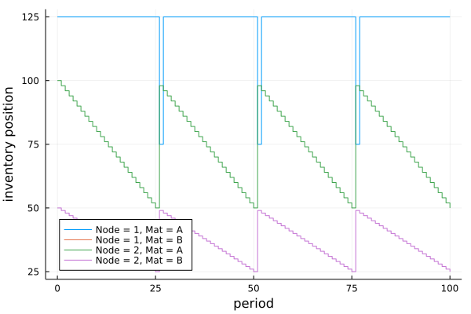

# InventoryManagement.jl:

*Discrete-time simulation environment for Inventory Management in Supply Networks.*


## Overview

*InventoryManagement.jl* allows defining a supply network with three main actors:
- `Producers`: Nodes where inventory transformation takes place (e.g., intermediates or final products are produced). These are the top-most (source) nodes in the network.
- `Distributors`: Intermediate nodes where inventory is stored and distributed (e.g., distribution centers).
- `Markets`: Nodes where end-customers place final product orders. These are the last  (sink) nodes in the network.

A `SupplyChainEnv` object is created based on system inputs and network structure, which can be used to simulate stochastic demand at the end distribution centers and inventory replenishment decisions throughout the network. The `SupplyChainEnv` can be used in conjunction with [ReinforcementLearning.jl](https://github.com/JuliaReinforcementLearning/ReinforcementLearning.jl) to train a Reinforcement Learning `agent`.

This package generalizes and extends and the inventory management environment available in [OR-Gym](https://github.com/hubbs5/or-gym).

## Dependencies

*InventoryManagement.jl* mainly relies on the following packages:
- [MetaGraphs.jl](https://github.com/JuliaGraphs/MetaGraphs.jl): Define supply network structure and specify node- and edge-specific parameters.
- [DataFrames.jl](https://github.com/JuliaData/DataFrames.jl): Tabulate results.
- [Distributions.jl](https://github.com/JuliaStats/Distributions.jl): Define probability distributions for the lead times in between nodes and the market demands at the end distributors.

## Sequence of Events

The following sequence of events occurs in each period of the simulation:
1. Start period.
2. Place inventory replenishment orders at each node. These are limited to the available production capacity (supplier is a producer) or available inventory (supplier is a distribution node). If `reallocate = true`, then any amount that cannot be satisfied is reallocated to the next priority supplier.
   - Distributors ship inventory.
   - Producers manufacture products (a production lead time begins). Production costs are incurred at the start of production.
   - Producers send orders that have completed (after the production lead time).
4. Receive inventory that has arrived at each node (after the lead time has transpired).
5. Pay suppliers for inventory received.
6. Pay shipper for inventory shipped.
7. Market demand occurs after tossing a weighted coin with the probability of demand occurring defined by the `demand_frequency`.
8. Demand (including any backlog if `backlog = true`) is fulfilled up to available inventory at the markets.
9. Unfulfilled demand is penalized and backlogged (if `backlog = true`).
10. Each node pays a holding cost and a transportation cost for on-hand inventory and in-transit inventory at each period.

## Model Assumptions

The following assumptions hold in the current implementation, but can be modified in future releases.

- `Producers` do not hold inventory.
- `Producers` have unlimitted supply of raw materials.
- `Producers` can produce material on demand (`make-to-order`).
- Replenishment orders can only be satisfied with current on-hand inventory or available production capacity.
- Backlogging is only allowed at the `Markets`, it is not allowed for inventory replenishment decisions.

## Inventory replenishment policies

At each iteration in the simulation, an `action` can be provided to the system, which consists of the replenishment orders placed on every link in the supply network. This `action` must be of type `Vector{Real}` and must be `nonnegative` of the form: `[Edge1_Product1, Edge1_Product2, ..., Edge1_ProductP, Edge2_Product1, ..., Edge2_ProductP, ..., EdgeE_Product1, ..., EdgeE_ProductP]`, where the ordering in the edges is given by `edges(env.network)` and the ordering in the products by `env.products`.

An `action` vector can be visualized as a `DataFrame` using `show_action(action, env::SupplyChainEnv)`.

The function `reorder_policy` can be used to implement an inventory reorder policy. The two most common policies used in industry are the `(s,S)` and `(r,Q)` [policies](https://smartcorp.com/inventory-control/inventory-control-policies-software/).

The `reorder_policy` takes the following inputs and returns an `action` vector.
- `env::SupplyChainEnv`: inventory management environment
- `param1::Dict`: the `s` or `r` parameter in each node for each product in the system. The `keys` are of the form `(node, product)`.
- `param2::Dict`: the `S` or `Q` parameter in each node for each product in the system. The `keys` are of the form `(node, product)`.
- `level::Symbol`: `:position` if the policy is based on the node's inventory position, or `:on_hand` if the policy is based on the node's on-hand inventory level.
- `kind::Symbol`: `:rQ` for an `(r,Q)` policy, or `:sS` for an `(s,S)` policy
- `supplier_selection::Symbol`: evenly distribute reorder quantities among all suppliers if `:random`; otherwise (if `:priority`), assign reorder quantities based on supplier priority (e.g., if supplier 1 does not have enough capacity or inventory, then request as much as possible and then request any remaining amount from the next supplier, and so forth).

## Model Inputs

### Node-specific

`Producers` will have the following fields in their node metadata:
- `:production_cost::Dict`: unit production cost for each product (`keys`)
- `:production_capacity::Dict`: maximum production capacity for each product (`keys`).
- `:production_time::Dict`: production lead time for each product (`keys`).

`Distributors` will have the following fields in their node metadata:
- `:initial_inventory::Dict`: initial inventory for each product (`keys`)
- `:holding_cost::Dict`: unit holding cost for each product (`keys`)
- `:supplier_priority::Dict`: `Vector` of supplier priorities (from high to low) for each product (`keys`). When a request cannot be fulfilled due to insufficient productio capacity or on-hand inventory, the system will try to reallocate it to the supplier that is next in line on the priority list (if `env.reallocate == true`).

`Markets` will have the following fields in their node metadata:
- `:initial_inventory::Dict`: initial inventory for each product (`keys`)
- `:holding_cost::Dict`: unit holding cost for each product (`keys`)
- `:supplier_priority::Dict`: `Vector` of supplier priorities (from high to low) for each product (`keys`). When a request cannot be fulfilled due to insufficient productio capacity or on-hand inventory, the system will try to reallocate it to the supplier that is next in line on the priority list (if `env.reallocate == true`).
- `:demand_distribution::Dict`: probability distributions for the market demands for each product (`keys`)
- `:demand_frequency::Dict`: probability that demand will occur (value between `0.0` and `1.0`) for each product (`keys`)
- `:sales_price::Dict`: market sales price for each product (`keys`)
- `:demand_penalty::Dict`: unit penalty for unsatisfied market demand for each product (`keys`)

### Edge-specific

All edges have the following fields in their metadata:
- `:sales_price::Dict`: unit sales price for inventory sent on that edge (from supplier to receiver) for each product (`keys`)
- `:transportation_cost::Dict`: unit transportation cost per period for inventory in-transit for each product (`keys`)
- `:lead_time::Distribution{Univariate, Discrete}`: the lead time on each edge

## Model Output

A `SupplyChainEnv` has the following fields:
- `network::MetaDiGraph`: Supply Chain Network (metagraph)
- `markets::Array`: list of market nodes
- `producers::Array`: list of producer nodes
- `distributors::Array`: list of distribution nodes (excludes end distributors where markets exist)
- `products::Array`: list of product names (strings)
- `inv_on_hand::DataFrame`: timeseries On Hand Inventory @ each node at the end of each period
- `inv_pipeline::DataFramet`: timeseries Pipeline Inventory on each edge at the end of each period
- `inv_position::DataFrame`: timeseries Inventory Position for each node at the end of each period
- `replenishments::DataFrame`: timeseries Replenishment orders placed on each edge at the end of each period
- `shipments::DataFrame`: current shipments and time to arrival for each node
- `production::DataFrame`: current material production committed to an edge and lead time to ship
- `demand::DataFrame`: timeseries with realization of demand, sold units, unfulfilled demand, and backlog at each market
- `profit::DataFrame`: timeseries with profit at each node
- `reward::Float64`: reward in the system (used for RL)
- `period::Int`: period in the simulation
- `num_periods::Int`: number of periods in the simulation
- `discount::Float64`: time discount factor (interest rate)
- `backlog::Bool`: backlogging allowed if `true`; otherwise, unfulfilled demand is lost sales
- `reallocate::Bool`: the system try to reallocate requests if they cannot be satisfied if `true`; otherwise, no reallocation is attempted.
- `seed::Int`: random seed

## Example

The example below is for a 100 period simulation of a supply network with one plant (node 1) that supplies and end distributor (node 2). A `s,S` reorder policy is used.

```julia
using LightGraphs, MetaGraphs, DataFrames, Distributions
using InventoryManagement, StatsPlots

#define network connectivity
net = MetaDiGraph(path_digraph(2)) # 1 -> 2
products = [:A]
set_prop!(net, :products, products)

#specify parameters, holding costs and capacity, market demands and penalty for unfilfilled demand
set_props!(net, 1, Dict(:production_cost => Dict(:A => 0.01),
                        :production_time => Dict(:A => 0),
                        :production_capacity => Dict(:A => Inf)))

set_props!(net, 2, Dict(:initial_inventory => Dict(:A => 100),
                        :holding_cost => Dict(:A => 0.01),
                        :demand_distribution => Dict(:A => Normal(5,0.5)),
                        :demand_frequency => Dict(:A => 0.5),
                        :sales_price => Dict(:A => 3),
                        :demand_penalty => Dict(:A => 0.01),
                        :supplier_priority => Dict(:A => [1])))

#specify sales prices, transportation costs, lead time
set_props!(net, 1, 2, Dict(:sales_price => Dict(:A => 2),
                          :transportation_cost => Dict(:A => 0.01),
                          :lead_time => Poisson(5)))

#create environment
num_periods = 100
env = SupplyChainEnv(net, num_periods)

#define reorder policy parameters
policy = :sS #(s, S) policy
on = :position #monitor inventory position
s = Dict((2,:A) => 20) #lower bound on inventory
S = Dict((2,:A) => 100) #base stock level

#run simulation with reorder policy
for t in 1:env.num_periods
    action = reorder_policy(env, s, S, on, policy, :priority)
    (env)(action)
end

#make plots
#profit
node_profit = groupby(env.profit, :node)
profit = transform(node_profit, :value => cumsum)
fig1 = @df profit plot(:period, :value_cumsum, group=:node, legend = :topleft,
                    xlabel="period", ylabel="cumulative profit")

#inventory position
inv_position = filter(i -> i.node in union(env.distributors, env.markets), env.inv_position)
fig2 = @df inv_position plot(:period, :level, group=(:node, :product), linetype=:steppost,
                    xlabel="period", ylabel="inventory position")

```



## Contact

**Author**: Hector D. Perez\
**Position**: Ph. D. Candidate @ Carnegie Mellon University\
**Email**: hdperez@cmu.edu\
**Year**: 2020
