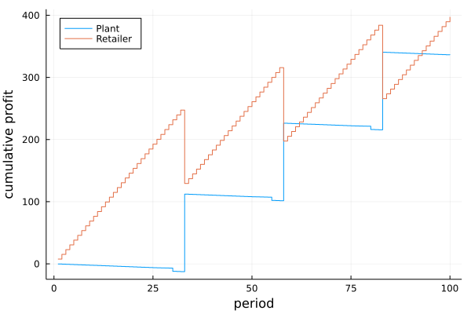
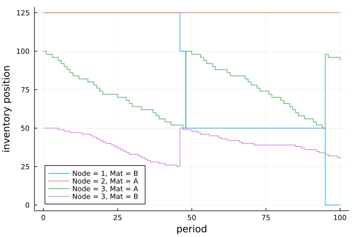

# Examples

## Example 1

This example is for a 100 period simulation of a supply network with one plant (node 1) that supplies a retailer (node 3), with stochastic demand for product `:A`. Node 3, has an alternate supplier, which is a distribution center (node 2). Node 3 prefers replenishing from the plant, which has a lower lead time. A `(s,S)` reorder policy is used at the retailer. When the on-hand level for material `:A` is depleted at the plant, the plant begins transforming raw material `:B` into `:A`. There is limited raw material supply at the plant. When the raw material stocks-out, node 3 switches to node 2 for its supply.

*See code [here](https://github.com/hdavid16/InventoryManagement.jl/blob/master/examples/ex1.jl).*

## Example 2

This example is for a 100 period simulation of a supply network with one warehouse (node 1) that supplies a retailer (node 2) with stochastic demand for product `:A`. A `(r,Q)` reorder policy is used at the retailer every 25 periods.

*See code [here](https://github.com/hdavid16/InventoryManagement.jl/blob/master/examples/ex2.jl).*

