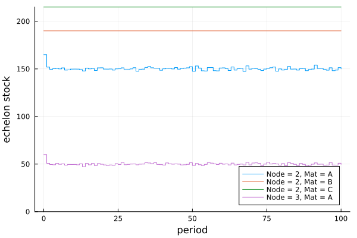

## Examples

### Example 1

This example has plant with unlimited raw material supply that converts `:B` to `:A` with a 1:1 stoichiometry. The plant sells both materials to a downstream retailer that has market demand for both materials. This system is modeled using 3 nodes:
- Plant: Node 1 (stores `:B`) => Node 2 (stores `:A`)
- Retailer: Node 3 buys `:B` from Node 1 and `:A` from Node 2

Demand and lead times are deterministic. A continuous review (s,S) policy is used. 100 periods are simulated.

*See code with system and policy parameters [here](https://github.com/hdavid16/InventoryManagement.jl/blob/master/examples/ex1.jl).*

### Example 2

This example has a distributor with unlimited inventory (Node 1) that sells `:A` to a retailer with market demand (Node 2).

Demand and lead time is stochastic. A periodic review (r,Q) policy is used. 100 periods are simulated.

*See code with system and policy parameters [here](https://github.com/hdavid16/InventoryManagement.jl/blob/master/examples/ex2.jl).*

### Example 3

This example has plant that converts `:C` to `:B` to `:A` with a 1:1 stoichiometry for each reaction. The plant acquires raw materials from a supplier upstream with unlimited supply of `:C` and sells `:A` to a retailer downstream. There is direct market demand of `:A` at both the retailer and the plant. Thus, the plant has both internal and external demand. This system is modeled using 5 nodes:
- Supplier: Node 1 (unlimited supply `:C`)
- Plant: Node 2 (stores raw `:C`) => Node 3 (stores intermediate `:B`) => Node 4 (stores product `:A` and sells it to both the retailer and the market)
- Retailer: Node 5 buys `:A` from Node 4 and sells `:A` to the market.

Demand and lead times are stochastic. A continuous review (s,S) policy is used. 100 periods are simulated.

*See code with system and policy parameters [here](https://github.com/hdavid16/InventoryManagement.jl/blob/master/examples/ex3.jl).*

