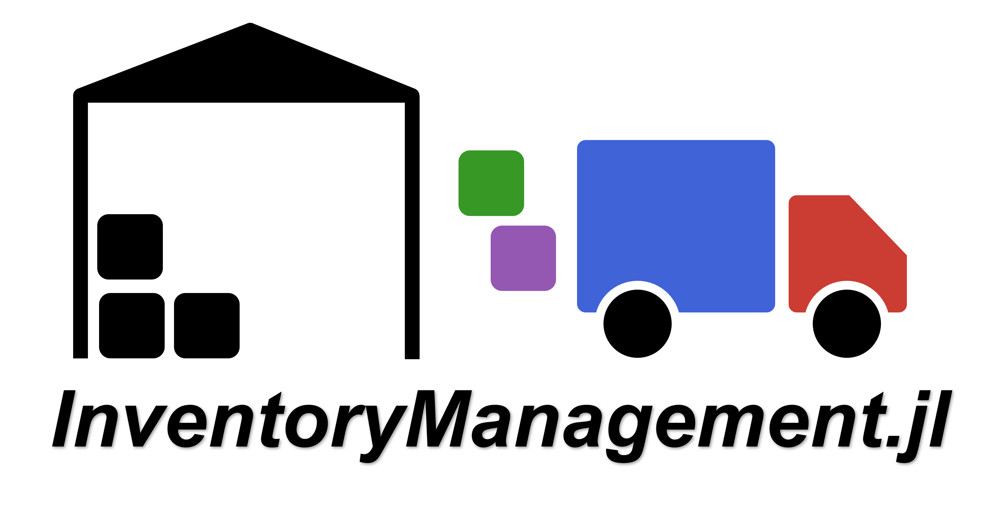

# InventoryManagement.jl:

*Discrete-time simulation environment for Inventory Management in Supply Networks.*



## Overview

*InventoryManagement.jl* allows modeling a multi-period multi-product supply network. A supply network can be constructed using the following node types:
- `Producers`: Nodes where inventory transformation takes place (e.g., intermediates or final materials are produced). Reactive systems, including those with co-products, can be modelled using [Bills of Materials](https://en.wikipedia.org/wiki/Bill_of_materials) (see [Model Inputs](@ref)).
- `Distributors`: Intermediate nodes where inventory is stored and distributed (e.g., distribution centers).
- `Markets`: Nodes where end-customers place final product orders (i.e., retailer). These are the last (sink) nodes in the network.

The simplest network that can be modeled is one with a single market with one producer or distributor. However, more complex systems can be modelled as well.

When defining a supply network, a `SupplyChainEnv` object is created based on system inputs and network structure. This object can then be used to execute a simulation of the inventory dynamics. During a simulation, stochastic demand at each of the markets can occur for each of the materials in each period. When product demand occurs at the market, sales are made based on available inventory. Any unfulfilled demand is either backlogged or considered a lost sale depending on the system definition. If no action is taken duirng the simulation, the inventory levels will eventually be depleted. To avoid this from happening, a decision-maker can interact with the system in each period by making inventory replenishment decisions (refered to as `actions`). Lead times for in-transit inventory as well as production lead times are accounted for in the simulation. Transportation lead times can be modelled stochastically to account for lead time uncertainty. From a service time perspective, demand at market nodes has zero service time, whereas non-market nodes have service time equal to the production lead time + transportation lead time.

The `SupplyChainEnv` can also potentially be used in conjunction with [ReinforcementLearning.jl](https://github.com/JuliaReinforcementLearning/ReinforcementLearning.jl) to train a Reinforcement Learning `agent`.

This package generalizes and extends and the inventory management environment available in [OR-Gym](https://github.com/hubbs5/or-gym).

## Dependencies

*InventoryManagement.jl* mainly relies on the following packages:
- [MetaGraphs.jl](https://github.com/JuliaGraphs/MetaGraphs.jl): Define supply network structure and specify node- and edge-specific parameters.
- [DataFrames.jl](https://github.com/JuliaData/DataFrames.jl): Tabulate results.
- [Distributions.jl](https://github.com/JuliaStats/Distributions.jl): Define probability distributions for the lead times in between nodes and the demands at the market nodes.

## Installation

The package can be installed with the Julia package manager. From the Julia REPL, type `]` to enter the `Pkg` REPL mode and run:

```julia
pkg> add InventoryManagement
```

## Contact

**Author**: Hector D. Perez\
**Position**: Ph. D. Candidate @ Carnegie Mellon University\
**Email**: hdperez@cmu.edu\
**Year**: 2021
